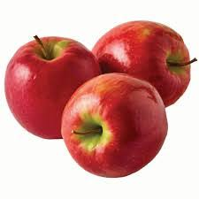

# I-rate-fruits-and-give-them-a-personality

<h1> <strong>WELCOME</strong> </h1>
Hi to everybody in the vicinity. today I'm going to rate some fruits on a scale of one to ten and then give them a persoanlity. So i hope you enjoy that.

<h2> Watermelon 10/10 </h2>

Watermelon is amazing, great, wonderful, a true blessing. Super refreshing during the Summero or really whenever. There also tons of antioxidants and it also hydrates you. Once a freind of mine whose name i will not disclose for privacy reasons said "watermelon is just crunchy water". I have never in my life been more dissapointed, CRUNCHY WATER, excuse me watermelon is so much more than crunch water. Unbeliveable.
Anyway lets move on to personality. Watermelon is the type of person whod youd go on spontaneous raod trips with in the summer but they're also the type of person who would accidnetly hit you with thier car.

<h2> Apple 5/10 </h2>

the only reason apple is getting a 5/10 is because i love apple dessertas. Apples taste absoulutley amazing if your starving to death, like you haven't eaten all day. I would never ever crave or deliberatly choose to eat an apple you know, it's just not that kind of fruit. Also sometimes they just don't taste correct at all like something is genuinly wrong. I think apples are really versatile and they're paired with something else. If apple were a person they'd be really depndable, like you know thyre always gonna be there for you no matter what. They're not like crazy and wack or super queit theyre just in the middle and there huge people persons.

i suddenly feel very sentimental about apples.

